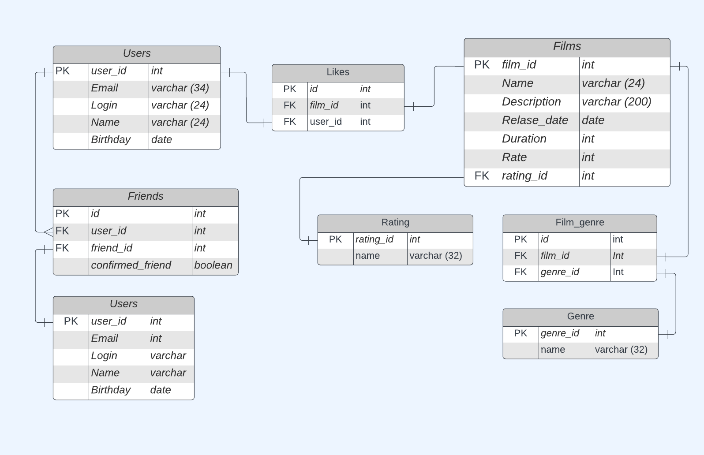

# ER-model database Filmrate




# Простые запросы
## User

- ### Запрос списка пользователей

```
SELECT *
FROM users;
```

- ### Запрос пользователя по id

```
SELECT *
FROM users
WHERE user_id = 1;
```

- ### Запрос списка друзей для пользователя с id 1

```
SELECT *
FROM users
WHERE user_id IN
    (SELECT friend_id
     FROM friends
     WHERE user_id = 1
     UNION ALL
     SELECT user_id
     FROM friends
     WHERE friend_id = 1);
```

- ### Запрос общих друзей для пользователей с id 1 и 2

```
SELECT *
FROM users
WHERE user_id IN
    (SELECT friend_id
     FROM friends
     WHERE (user_id = 1
            OR user_id = 2)
       AND confirmed_friend = 't'
       AND friend_id NOT IN (1,
                             2)
     UNION ALL 
     SELECT user_id
     FROM friends
     WHERE (friend_id = 1
            OR friend_id = 2)
       AND confirmed_friend = 't'
       AND user_id NOT IN (1,
                           2));
```

## Film

- ### Запрос списка фильмов

```
SELECT *
FROM films;
```

- ### Запрос фильма по id

```
SELECT *
FROM films
WHERE film_id = 1;
```
- ### Запрос топ-10 фильмов

```
SELECT *
FROM films
WHERE film_id IN
    (SELECT film_id
     FROM likes
     GROUP BY film_id
     ORDER BY COUNT(user_id) DESC
     LIMIT 10);
```
